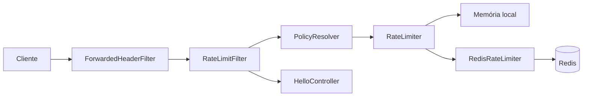

# rate-limiter

API pequena protegida por rate limit. Os únicos recursos são `GET /api/hello` e `GET /api/expensive`. O objeto do projeto é o limitador: token bucket, política por rota, estado local ou no Redis, e a resposta HTTP.

## Executar

JDK 21 e Docker.

```powershell
docker compose up -d
.\mvnw.cmd spring-boot:run
```

A API sobe em `http://localhost:8080`. No Unix o comando é `./mvnw spring-boot:run`.

Uma segunda instância usa o mesmo Redis:

```powershell
.\mvnw.cmd spring-boot:run "-Dspring-boot.run.arguments=--server.port=8081"
```

Os testes:

```powershell
.\mvnw.cmd test
```

`RedisRateLimitIntegrationTest` e `RedisStopsRespondingIntegrationTest` sobem um Redis no Testcontainers. Sem Docker esses dois não rodam.

## Arquitetura



O `ForwardedHeaderFilter` só entra quando `rate-limit.trust-forwarded-headers` é `true`. Sem política para a rota, o filtro não consulta o limitador.

## Limite

Bucket4j 8.19, token bucket, reposição greedy. A capacidade é o burst: o bucket começa cheio. `refill-tokens` voltam ao longo de `refill-period`, de forma contínua. Dez tokens por minuto não esperam o fim do minuto: o próximo token leva cerca de seis segundos.

`rate-limit.storage` aceita `local` ou `redis`. Outro valor impede a subida. `local` guarda o bucket no processo. `redis` é compartilhado entre instâncias. Com `redis`, a aplicação não sobe se o Redis estiver inacessível.

A chave é `rl:{política}:{consumidor}`.

As políticas são uma lista ordenada. Vale o primeiro padrão Ant que casar. Rota sem política não é limitada. `expensive` precisa vir antes de `/api/**`, senão o padrão largo engole `/api/expensive`.

## Consumidor

O identificador é o IP do socket, normalizado: espaços removidos, minúsculas, porta e zona de IPv6 removidas, e `::ffff:a.b.c.d` vira o IPv4. Endereço vazio usa a chave única `unknown`. Não há consulta DNS.

`trust-forwarded-headers` começa `false`, então `X-Forwarded-For` é ignorado. Com `true`, o filtro do Spring reescreve o endereço antes do limite e fica com o primeiro da lista. O proxy precisa substituir o header. Com a opção ligada e a API exposta direto, o cliente escolhe o próprio bucket.

NAT junta clientes no mesmo limite. IPv6 pode gerar uma chave por endereço. Uma estratégia futura pode ler uma API key ou um id de usuário e manter a mesma chave de armazenamento. Não há autenticação.

## HTTP

Resposta dentro da cota:

```http
RateLimit-Policy: "default";q=100;w=60
RateLimit: "default";r=99;t=1
```

`q` é a capacidade e `w` é o período de reposição, em segundos. Nas políticas desta aplicação, esses `q` tokens voltam ao longo de `w`. `r` é o que sobrou depois do pedido. Num sucesso, `t` é o tempo, arredondado para cima, até poder chegar mais um token. No `429`, `t` é igual a `Retry-After`: a espera real até o próximo token, em segundos, com fração para cima e mínimo de 1.

O corpo do `429` é `application/problem+json`, tipo `quota-exceeded` do draft [draft-ietf-httpapi-ratelimit-headers-11](https://www.ietf.org/archive/id/draft-ietf-httpapi-ratelimit-headers-11.html). Não há headers `X-RateLimit-*`. O IP não é ecoado.

## Redis indisponível

A falha é fechada. O pedido limitado não chega no controller. A resposta é `503`, com `Retry-After` igual ao `command-timeout` (1 segundo na configuração atual). Não é `429`: a cota não foi calculada. Caminho sem política não consulta o Redis.

Um Redis lento estoura o timeout e cai no mesmo `503`. Com o socket caído, o Lettuce rejeita o comando e reconecta sozinho. O Compose não tem volume: depois de um restart as chaves somem e cada bucket volta cheio.

O limitador local usa o relógio monotônico da JVM. No Redis, o Bucket4j usa o relógio distribuído padrão. Instâncias com relógio distante discordam do instante do token. A premissa é NTP.

## Métricas

Só `/actuator/health` e `/actuator/metrics`. O health não mostra detalhes. O ping é o da conexão usada pelo limite, e só existe quando `storage` é `redis`.

| Métrica | Tags |
| --- | --- |
| `rate.limit.requests` | `policy`, `result` (`allowed` ou `rejected`) |
| `rate.limit.consume` | `policy` |
| `rate.limit.store.errors` | nenhuma |

O endereço do cliente não vira tag. O log registra a carga das políticas e a falha do Redis. Não registra cada pedido permitido nem cada `429`.
